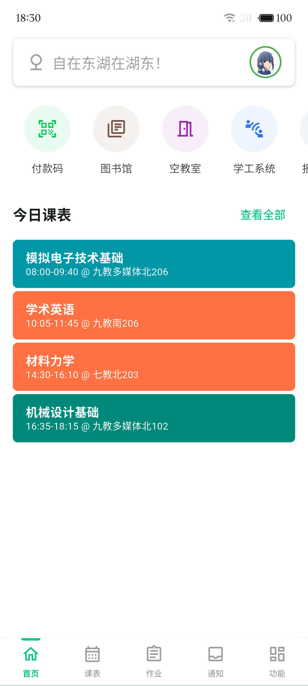
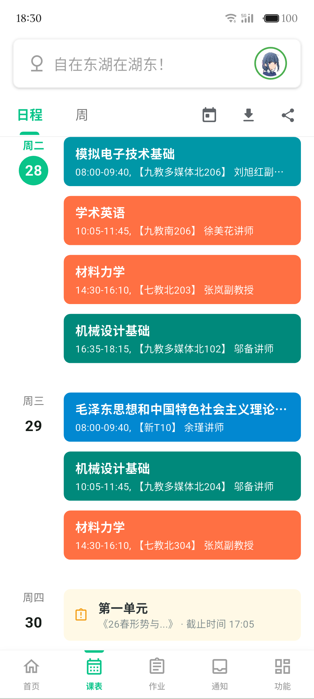
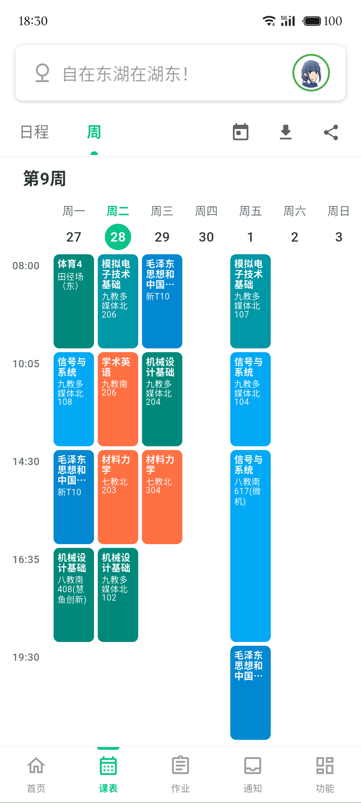
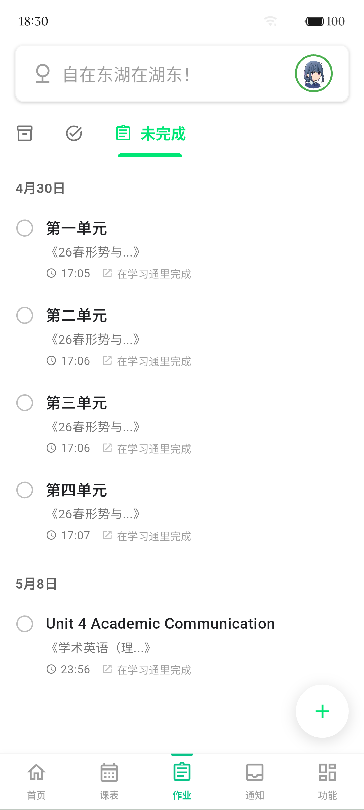
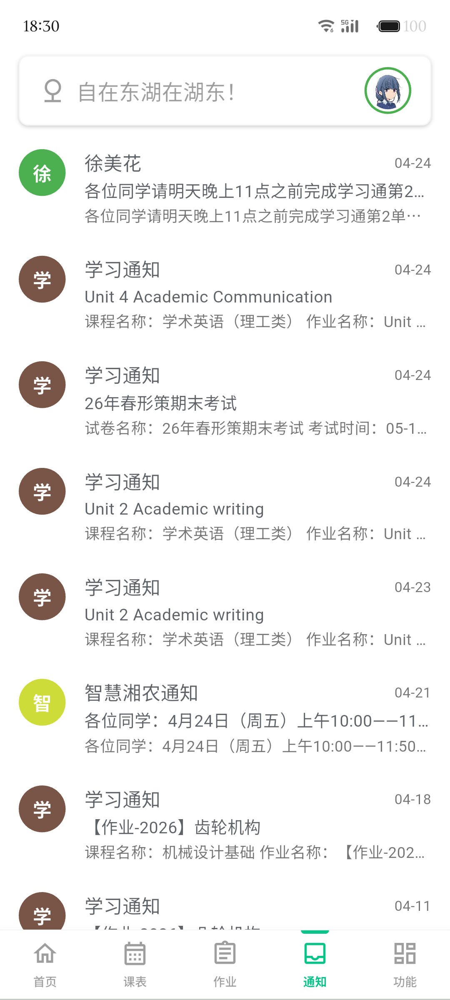
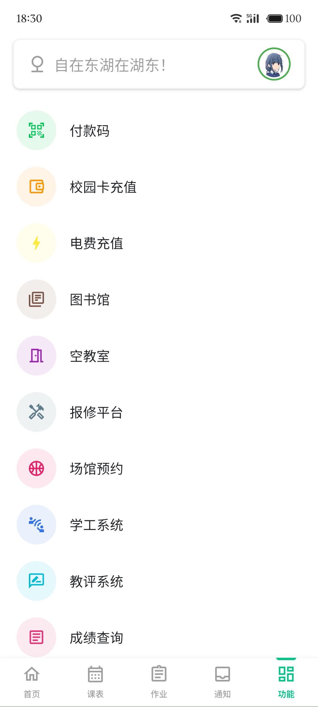
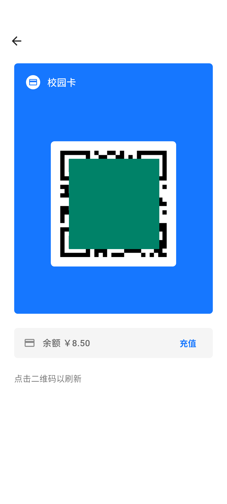

# 自在东湖（ChillEast）

使用 Flutter 编写的湖南农业大学第三方客户端，主力服务于本科生的日常生活。

> “自在”取“心境安闲、身心舒畅，不受拘束、不被世俗烦恼困扰的自由状态”之意，“东湖”则源自东湖街道办、东湖公园、东湖宿舍区、东湖食堂、东湖夜市，故指代农大。

> 图标中的曲线来自学校南侧的浏阳河，河道在此处形成的“第七道湾”，呈“几”字形弯折。

# 下载

|系统|应用商店|Release|内地镜像|
|---|---|---|---|
|Android|[咕咕咕]|[Release](https://github.com/soilzhu/ChillEast/releases/latest)|[咕咕咕]|
|iOS|[咕咕咕]|[咕咕咕]|[咕咕咕]|

# 关于项目

> ⚠️ 本项目完全 Vibe Coding 开发，请您谨慎考虑是否使用本应用。代码质量可能无法保证，Bug 可能较多。

> 🎉 欢迎各位同学前来贡献协助本项目。

> 📞 欢迎使用 Mac 和 iPhone 的同学参与 iOS 端构建调试！

一个尽可能好用点的湖南农大用的 App 。

### 目前已经使用原生 UI 实现的功能：
- 课程表
- 空教室查询
- 作业列表
- 成绩查询
- 校园卡付款码
- 校园卡充值（暂时只支持支付宝）
- 电费充值
- 学习通通知
- WebVPN 链接转换

### 目前使用 WebView 加载官方网页的功能：
- 图书馆座位
- 学工系统
- 报修平台
- 实时校车
- 长沙实时公交
- 场馆预约
- 教评系统
- 讲座预约
- 办事大厅

# 贡献者

# 预览

|首页|日程|课表|作业|通知|功能|付款码|
|:-:|:-:|:-:|:-:|:-:|:-:|:-:|
||||||||

# TODO
- [ ] 图书馆座位的原生UI实现
- [ ] 场馆预约的原生UI实现
- [ ] 校园卡充值的微信支持
- [ ] 学工系统的原生UI实现
- [ ] 报修平台的原生UI实现
- [ ] 实时校车的原生UI实现
- [ ] 通知接入
- [ ] 由大模型驱动的手动作业添加

# 感谢

灵感来源：[Life@USTC](https://github.com/Life-USTC/Life-USTC) ，一个优秀的帮助中国科大学生获取日常学业相关信息。

感谢 Flutter 社区开源的组件们，将会尽力同步于应用中的“开源声明”页面。

# 寻求帮助

- 邮件反馈： soilzhu80@gmail.com

- telegram 上联系： @mintrainy

- issue 反馈